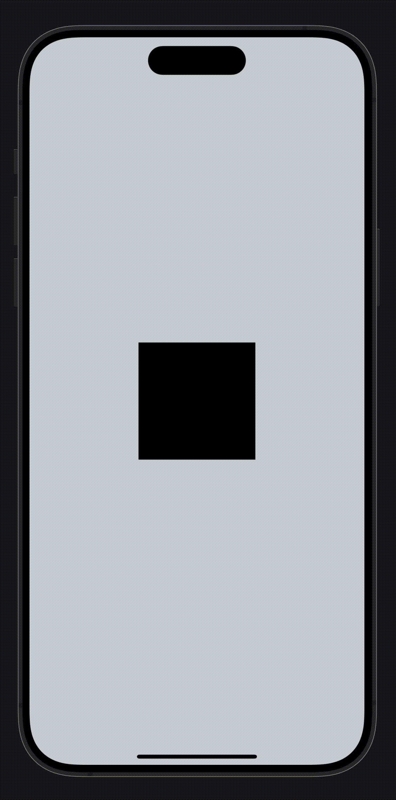

# React Native Drag-and-Drop Snippet

This repository provides a simple implementation of drag-and-drop functionality in React Native, including basic animation support. This snippet demonstrates how to create a draggable component using `react-native-reanimated` and `react-native-gesture-handler`.

## Usage

To use this snippet in your React Native project, follow these steps:

1. **Install Dependencies:**

   Make sure you have the required dependencies installed:

   ```bash
   npm install react-native-reanimated react-native-gesture-handler react-native-svg
   ```

2. **Add the Drag-and-Drop Component:**

   Create a new file, for example, `DragAndDrop.js`, and add the following code:

   ```jsx
   import {View, StatusBar} from 'react-native';
   import Animated, {
     useSharedValue,
     useAnimatedStyle,
     useAnimatedGestureHandler,
   } from 'react-native-reanimated';
   import {PanGestureHandler} from 'react-native-gesture-handler';
   import Svg, {Path} from 'react-native-svg';

   const DragAndDrop = () => {
     const x = useSharedValue(0);
     const y = useSharedValue(0);

     const gestureHandler = useAnimatedGestureHandler({
       onStart: (_, ctx) => {
         ctx.startX = x.value;
         ctx.startY = y.value;
       },
       onActive: (event, ctx) => {
         x.value = ctx.startX + event.translationX;
         y.value = ctx.startY + event.translationY;
       },
     });

     const animatedStyle = useAnimatedStyle(() => ({
       transform: [{translateX: x.value}, {translateY: y.value}],
     }));

     return (
       <View style={{flex: 1, justifyContent: 'center', alignItems: 'center'}}>
         <StatusBar hidden />
         <PanGestureHandler onGestureEvent={gestureHandler}>
           <Animated.View style={animatedStyle}>
             <Svg width="150" height="150">
               <Path d="M0,0 L150,0 L150,150 L0,150 Z" />
             </Svg>
           </Animated.View>
         </PanGestureHandler>
       </View>
     );
   };

   export default DragAndDrop;
   ```

   For more advanced use cases, you can utilize `useAnimatedProps` to dynamically update SVG paths.

3. **Run Your Project:**

   After adding the component, you can use it in your React Native application like so:

   ```jsx
   import DragAndDrop from './DragAndDrop';

   export default function App() {
     return <DragAndDrop />;
   }
   ```

## Demonstration

See how the component works in action:



## Contributing

Feel free to open issues or submit pull requests if you have suggestions or improvements.

## License

This project is licensed under the MIT License - see the LICENSE file for details.
